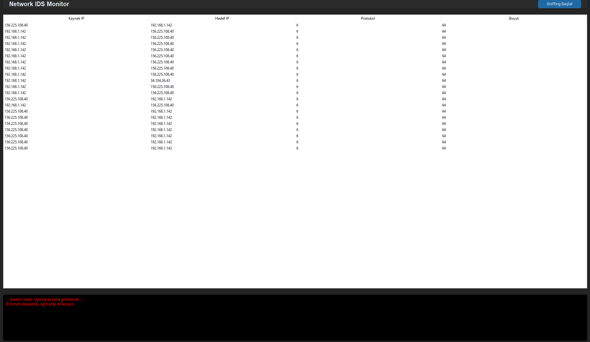

# Network Intrusion Detection System

Gerçek zamanlı ağ trafiği izleme ve saldırı tespit sistemi. Python tabanlı bu araç, ağ paketlerini yakalar, analiz eder ve şüpheli aktiviteleri anında görsel arayüz üzerinden raporlar.

---

## Özellikler

- Gerçek Zamanlı Paket Yakalama — Scapy ile canlı ağ trafiğini dinler
- Port Tarama Tespiti — Tek bir kaynaktan 15'ten fazla farklı porta erişim girişimlerini yakalar
- SYN Flood Tespiti — 1 saniye içinde 100'den fazla SYN paketi gönderen saldırıları tespit eder
- Modern Karanlık Arayüz — CustomTkinter ile şık, gerçek zamanlı görsel panel
- Dahili Saldırı Simülatörü — Test amaçlı Port Scan ve SYN Flood saldırılarını simüle eder

---

## Proje Yapısı

```
Network Ids/
├── main.py                  # Ana uygulama — controller katmanı
├── requirements.txt         # Bağımlılıklar
├── test_attacker.py         # Saldırı simülatörü (test amaçlı)
└── src/
    ├── __init__.py
    ├── capture.py           # Paket yakalama ve özellik çıkarımı
    ├── engine.py            # Tehdit analiz motoru (kural tabanlı)
    └── gui.py               # Tkinter/CustomTkinter arayüzü
```

---

## Ekran Görüntüleri




## Kurulum

**Gereksinimler:** Python 3.10+

```bash
# Depoyu klonlayın
git clone https://github.com/kullanici/network-ids.git
cd network-ids

# Bağımlılıkları yükleyin
pip install -r requirements.txt
```

`requirements.txt` içeriği:
```
scapy
customtkinter
```

---

## Kullanım

### IDS'i Başlatma

```bash
# Linux/macOS — root yetkisi gereklidir (ham soket için)
sudo python main.py

# Windows — Yönetici olarak çalıştır
python main.py
```

Uygulama açıldıktan sonra **"Sniffing Başlat"** butonuna tıklayın. Sistem ağ trafiğini dinlemeye ve tehditleri analiz etmeye başlar.

### Saldırı Simülatörü (Test)

IDS çalışırken, ayrı bir terminalde simülatörü çalıştırarak sistemin tepkisini test edebilirsiniz:

```bash
sudo python test_attacker.py
```

Bu komut sırasıyla şunları simüle eder:
1. `127.0.0.1` hedefine **Port Scan** (20–40 arası portlara SYN)
2. 3 saniye bekleme
3. `127.0.0.1` hedefine **SYN Flood** (120 adet SYN paketi)

---

## Tespit Kuralları

| Tehdit Türü | Kural | Önem Seviyesi |
|-------------|-------|---------------|
| `PORT_SCAN` | Tek kaynaktan > 15 farklı port hedefleme | 🟠 HIGH |
| `SYN_FLOOD` | 1 saniyede > 100 SYN paketi (ACK olmadan) | 🔴 CRITICAL |

Tespit edilen tehditler arayüzün alt kısmındaki kırmızı uyarı panelinde şu formatta görüntülenir:

```
[!] [CRITICAL] SYN_FLOOD Tespit Edildi! Kaynak IP: 192.168.1.100
[!] [HIGH] PORT_SCAN Tespit Edildi! Kaynak IP: 10.0.0.5
```

---

## Mimari

```
          [ Ağ Trafiği ]
                │
                ▼
        ┌──────────────┐
        │  capture.py  │  ← Scapy ile paket yakalama
        │ (packet_queue│     IP/TCP/UDP özellik çıkarımı
        └──────┬───────┘
               │ Queue
               ▼
        ┌──────────────┐
        │  engine.py   │  ← Kural tabanlı analiz
        │AnalysisEngine│     SYN Tracker, Port Tracker
        └──────┬───────┘
               │ Alerts
               ▼
        ┌──────────────┐
        │    gui.py    │  ← CustomTkinter arayüzü
        │   IDSGui     │     Tablo + Uyarı Paneli
        └──────────────┘
```

---

## Uyarılar

- Bu araç **yalnızca eğitim ve test amaçlıdır**. Gerçek ağlarda izin alınmadan kullanılması yasaldışı olabilir.
- Paket yakalama için **root / yönetici** yetkisi gereklidir.
- `test_attacker.py` simülatörünü yalnızca **kendi sisteminizde veya izinli test ortamlarında** çalıştırın.

---

## Gelecek Geliştirmeler

- [ ] Makine öğrenmesi tabanlı anomali tespiti
- [ ] ICMP Flood ve UDP Flood desteği
- [ ] Log dosyasına kaydetme (JSON / CSV export)
- [ ] IP kara liste yönetimi
- [ ] E-posta / webhook uyarı entegrasyonu

---

## Lisans

Bu proje MIT Lisansı ile lisanslanmıştır.

Teşekkürler <3